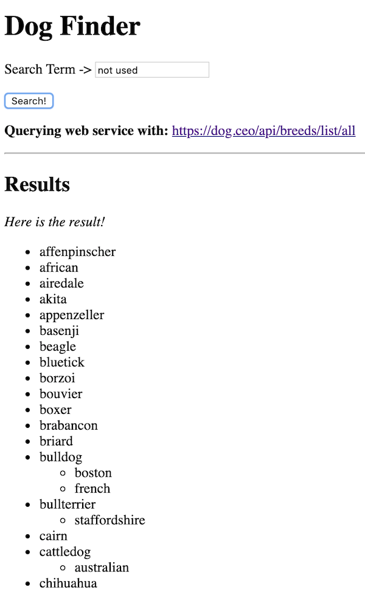

# Week 10A - Intro to Web Services

## I. Review: wrap-up of "unit 2"
- We just completed 3-1/2 lectures about working with [**Unstructured Text**](https://en.wikipedia.org/wiki/Unstructured_data) - by both analyzing it and by creating [**Generative Text**](https://en.wikipedia.org/wiki/Generative_art) experiments. Here is a summary of the concepts, topics and exercises:
  - loading text via &lt;input>, &lt;textarea>, &lt;file>, drag-and-drop, and also via the `XMLHttpRequest` object (XHR)
  - manipulating text using `String` and `Array` methods, as well as regular expressions
  - creating a [*Palindrome Detector*](https://github.com/tonethar/IGME-330-Master/blob/master/notes/HW-palindrome-detector.md) - palindromes are a form of [**Constrained Writing**](https://en.wikipedia.org/wiki/Constrained_writing)
  - creating a [*Diastic Machine*](https://github.com/tonethar/IGME-330-Master/blob/master/notes/text-2.md#III) demo in class, which was another example of Constained Writing
  - learning about how to count all of the words on a page, how to designate and remove words we are not interested in ([**Stop Words**](https://en.wikipedia.org/wiki/Stop_words)) by utilizing array methods, and then making our own [*Word Cloud*](https://github.com/tonethar/IGME-330-Master/blob/master/notes/HW-word-cloud.md) app
  - utilizing the [RiTa.js](http://rednoise.org/rita/) library to analyze text for the parts-of-speech of words, and saw how to query the library for random words of the same part of speech, and similar sounding words. With this information we created a [*Maddening Libs*](https://github.com/tonethar/IGME-330-Master/blob/master/notes/text-4.md#III) web app. We also saw that RiTa can be used to singularize/pluralize word and for verb conjugation
  - finally, we learned about how to use RiTa to specify a *grammar*, *terminal* and *non-terminal* symbols, and *production rules*. We looked at a [Haiku](https://grammar.yourdictionary.com/style-and-usage/rules-for-writing-haiku.html) demo, and we created a fantasy place name generator that utilized a grammer, [*HW - ill-Favored Coast*](https://github.com/tonethar/IGME-330-Master/blob/master/notes/text-5.md#V) 
- Let's quickly review the *Maddening Libs* and *ill-Favored Coast* homework
  

## II. Overview
- We are now moving into the third part of the course, where we will build data-driven applications utilizing web services. In the next few weeks we will cover the following concepts:
  - intro (or review for some of you) of using web services both in the browser, and in a command-line application
  - creating our own web service
  - utilizing multiple web services (such as google maps) to build a web service *mashup*
  - storing data in the "cloud" via Firebase
  - *data binding* - learning how to utilize "reactive" frameworks like Vue.js

## III. Today's Topics
- ***But first, a public service announcement about today's lecture***:
  - If you took IGME-230 *Web Site Design & Implementation* prior to 2171, you have not seen this material before
  - If you took IGME-230 in 2171 or 2175, this was *optional* material that you may have seen if you decided to do a Web Service App for Project 2
  - If you took IGME-230 in 2181, this was required material, therefore much of today's lecture will be review
- Consuming Web Services in a browser:
  - [Web Apps - Part 10 (IGME-230)](https://github.com/tonethar/IGME-230-Master/blob/master/notes/web-apps-10.md) - we will review these IGME-230 notes
  - [Web Service App - Examples & Starters (IGME-230)](https://github.com/tonethar/IGME-230-Master/blob/master/notes/web-service-app-starters.md) - this is starter code that demos how to use several web services
  - [HW - GIF Finder](https://github.com/tonethar/IGME-230-Master/blob/master/notes/HW-gif-finder.md) - you should have completed this already:
    - We are going to review the concepts together - if you have any questions about it - ask!
    - If your version was not perfect, fix it!
    - And if you didn't complete this HW assignment, do so ASAP!
 
 ## IV. Demos
 For demos, we'll utilize 2 services:
 
 ### IV-A. Dog API
 - Docs are here: https://dog.ceo/dog-api/documentation/
 - Grab the demo start code [here](https://github.com/tonethar/IGME-230-Master/blob/master/notes/web-service-app-starters.md#random-dog) - and be sure to grab **dog-xhr.html** (the XHR version)
     - try out the start version - notice that this API endpoint is pretty simple to use because it does not require us to send any additional parameters along
     - now we will modify the code to utilize the "List all breeds" API endpoint (see Dog API docs link above)
     - first get just the "top-level" breeds to show
     - then be sure that the sub-breeds are also displayed
     - note: this endpoint also does not require any additional parameters
     - see screenshot below:

### IV-B. Anime Schedule API

## V. Other Resources
- https://github.com/toddmotto/public-apis
- https://github.com/abhishekbanthia/Public-APIs

| <-- Previous Unit | Home | Next Unit -->
| --- | --- | --- 
| [**week-09B-notes.md**](week-09B-notes.md)     |  [**IGME-330 Schedule**](../schedule.md) | [**week-10B-notes.md**](week-10B-notes.md)
