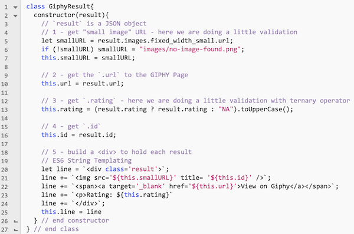
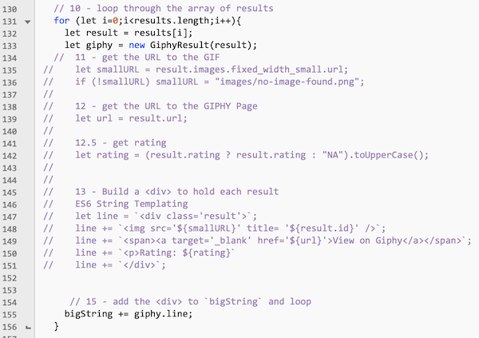

# Week 10B - ES6 Classes & Modules

## I. Using ES6 Classes in a Web App

- We are going to create a `GiphyResult` class for use in our GIF Finder HW
- Why create classes? It's easier to split the work up between team members, as well as debug, test and maintain your code
- Each `GiphyResult` instance will represent a single result that we get back from the Giphy web service
- This class will encapsulate our parsing logic, and also do some data validation
- Most of the code for this `GiphyResult` class is copied from the "result loop" in `searchButtonClicked()` and lightly modified
- Because we have a lot to do today, we are giving you the completed code. For now, add this class to the top of **main.js** (depending on how you wrote your code for the GIF Finder HW, you might need to modify this slightly):

- To use this code, make the "result loop" look like this: 

- Once you are all done, your code should work as before

## II. ES6 Modules 

- Let's discuss [ES6 Modules](https://github.com/tonethar/IGME-330-Master/blob/master/notes/ES6-modules-1.md)

<!--
## III. NodeJS
- How to set up NodeJS
- Consuming Web Services from a command-line Node.js app. See mycourses dropbox for the due dates:
  - [Node.js and Web Services - 1](https://github.com/tonethar/IGME-330-Master/blob/master/notes/node-and-web-services-1.md)
  - [Node.js and Web Services - 2](https://github.com/tonethar/IGME-330-Master/blob/master/notes/node-and-web-services-2.md)
-->

| <-- Previous Unit | Home | Next Unit -->
| --- | --- | --- 
| [**week-10A-notes.md**](week-10A-notes.md)     |  [**IGME-330 Schedule**](../schedule.md) | [**week-11A-notes.md**](week-11A-notes.md)
